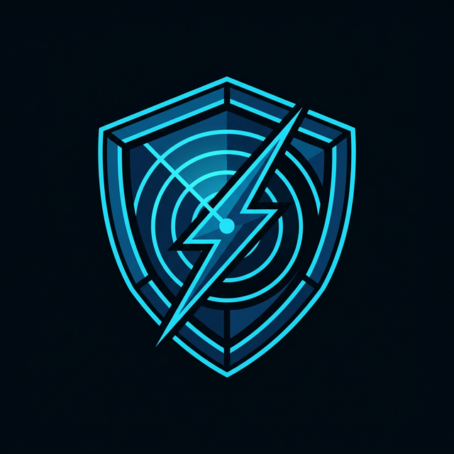

<div align="center">
  
  <h1>Kharma Sentinel</h1>
  <p><b>Advanced Offensive Intelligence & Real-Time Active Defense Suite</b></p>
  <p>
    <a href="#"></a>
    <a href="#"></a>
    <a href="#"></a>
  </p>
</div>

---

## 🛡️ Beyond Monitoring: Active Sovereignty

**Kharma Sentinel** is not just another network monitor. It is a high-performance, proactive defense system designed for security engineers who demand absolute visibility and control over their infrastructure. 

In a world of silent data exfiltration and background backdoors, Kharma acts as your **Digital Eyes**, unmasking every hidden connection, validating processes against global threat intelligence, and automatically neutralizing threats before they can execute their payloads.

---

## 🔥 Professional Features

- ⚡ **Minimalist High-Performance Dashboard:** A streamlined, surgical-grade interface built for low latency and high data density.
- 📡 **Deep Packet Inspection (DPI):** Real-time protocol detection and signature matching (SQLi, XSS, anomalous payloads).
- 🌍 **Dynamic Geo-Intelligence:** Powered by an offline MaxMind engine for 0ms lag resolution. Visualizes every socket on a global map.
- 🦠 **Automated EDR (VirusTotal Integration):** Computes SHA-256 hashes on the fly and validates them against 70+ Anti-Virus engines.
- ⚔️ **Active Defense (Safe-Shield):** Automatically terminates malware-associated processes and blocks malicious IPs at the OS level.
- 🤖 **Telegram Guardian Bot:** Receive critical breach alerts directly to your mobile device via Telegram.
- 🗄️ **Forensic Time Machine:** Persistent SQLite logging for detailed post-incident analysis.

---

## 🚀 Quick Launch

### 📦 Installation
Currently, Kharma can be deployed via the repository. (PyPI coming soon).

```bash
git clone https://github.com/Mutasem-mk4/kharma-network-radar.git
cd kharma-network-radar
pip install -r requirements.txt
python main.py web
```

### 💻 Command Line Interface
Kharma features a rich, professional CLI for system administrators.

| Command | Action |
|---|---|
| `kharma run` | Start the Terminal UI Radar. |
| `kharma run --protect` | Enable **Active Defense** (Auto-Kill Malware). |
| `kharma web` | Launch the Professional Web Dashboard. |
| `kharma daemon start` | Run as a background system guardian. |

---

## 🏗️ Technical Architecture
- **Core Engine:** Python 3.10+ (Asynchronous Socket Hooking)
- **Frontend:** Vanilla JS / CSS (Optimized for speed) / Leaflet.js
- **Backend:** Flask / JWT Security / JWT-based API
- **Data:** MaxMind GeoIP / SQLite / Cloud Intelligence Modules

---

## 🛡️ Security First
All sensitive tokens (Telegram, VirusTotal) are stored securely and never transmitted in plain text. Kharma is designed with privacy and system stability as the top priorities.

---

<div align="center">
  <h3>Designed & Engineered by <a href="https://github.com/Mutasem-mk4">Mutasem</a></h3>
  <p><i>Kharma Sentinel - Your Network, Your Rules.</i></p>
</div>

