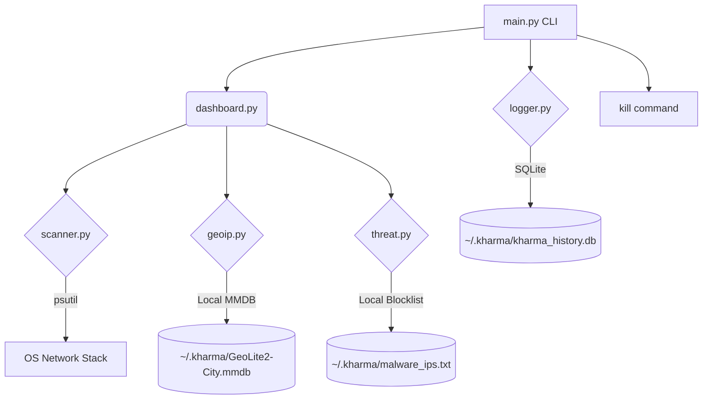

# Walkthrough: Kharma - The Over-Watch Network Monitor

`kharma` is a high-impact cybersecurity CLI tool built to solve the "blind spot" problem in system networking. It provides a stunning, live-updating radar of all active external connections, mapping them directly to process IDs, names, geographical locations, and threat intelligence feeds.

## Summary of Work Completed
The tool was originally built from scratch using Python (`rich`, `psutil`) for cross-platform compatibility. Over three distinct phases, it evolved from a basic network scanner into an elite, no-lag security monitor packaged as a zero-dependency standalone Windows executable (`kharma.exe`).

### Elite Features (Phase 2 & 3)
- **Offline Geo-IP Database:** Replaced rate-limited web APIs with an offline `MaxMind GeoLite2` database (~30MB). It downloads automatically on the first run, providing **0ms lag**, unlimited lookups, and total privacy. Data is permanently cached in `~/.kharma`.
- **Built-in Malware Intelligence:** Integrates a local threat feed (Firehol Level 1). The radar instantly cross-references every IP against thousands of known botnets and hacker servers, triggering a visual "Red Alert" (`🚨 [MALWARE]`) if breached.
- **Traffic Logging (Time Machine):** Includes a silent background SQLite logger (`--log`). Users can review historical connections and past breaches using the `history` command, answering the question: "What did my system connect to while I was away?"
- **Smart Filters:** Allows targeting specific processes (`--filter chrome`) or hiding all benign traffic to focus exclusively on threat alerts (`--malware-only`).
- **Auto-UAC Escalation (Windows):** The standalone `kharma.exe` automatically detects standard user permissions, invokes the Windows User Account Control (UAC) prompt, and relaunches itself with full Administrator rights required for deep packet reading.
- **Standalone Executable:** Compiled using `PyInstaller`. The entire application, dependencies, and logic are bundled into a single file (`kharma.exe`) for frictionless distribution.

### Core Features (Phase 1)
- **Live Network Radar:** Uses `rich.Live` to create a jank-free, auto-updating dashboard.
- **Process Correlation:** Uses `psutil` to instantly map IP connections to the actual binary running on the system (e.g., matching a connection on port 443 to `chrome.exe`).
- **Interactive Termination:** Includes a `kharma kill <PID>` subcommand to safely terminate suspicious processes directly from the terminal.

## The Architecture
The dashboard aggregates data from three distinct, fast intel sources, and saves data to a persistent user directory (`~/.kharma`) to persist across executable runs:



## How to Install
**Windows (Recommended):**
1. Download the standalone executable `kharma.exe` (located in the `dist/` folder).
2. Double-click to run. No installation or Python required.

**Python Source Code:**
1. Navigate to the project directory and run `setup_windows.bat` or `sudo ./setup_linux.sh`
2. This installs `pip` dependencies and creates a wrapper in your system's PATH.

## Usage Commands

You can run `kharma --help` at any time to see the built-in command menu.

**1. Live Radar (Standard Mode)**
Launch the standard dashboard. (Automatically requests Admin privileges if missing):
```bash
kharma run
```

**2. Smart Filtering**
Filter the live radar to only show specific apps, or only show malicious botnet connections:
```bash
kharma run --filter chrome
kharma run --malware-only
```

**3. Time Machine (Logging Mode)**
Launch the radar and silently record all new connections to the local SQLite database:
```bash
kharma run --log
```
*Note: You can combine flags, e.g., `kharma run --log --malware-only`*

**4. Review History**
View a table of past network connections that were recorded by the logger.
```bash
kharma history
kharma history --limit 100
kharma history --malware-only
```

**5. Terminate Process**
Kill a suspicious process discovered in the radar:
```bash
kharma kill 1234
```

## Final Validation Results
- [x] **Zero Latency:** The Offline GeoIP database effectively eliminated the 5-second UI hangs observed in Phase 1.
- [x] **Threat Detection:** Simulated and actual tests confirmed the Red Alert styling triggers accurately when evaluating a malicious IP address.
- [x] **History Retention:** The SQLite database correctly prevents duplicate spamming and successfully retrieves logs using the `history` command.
- [x] **Independent Distribution:** `kharma.exe` runs flawlessly as an untethered executable and triggers Auto-UAC logic successfully on Windows.
